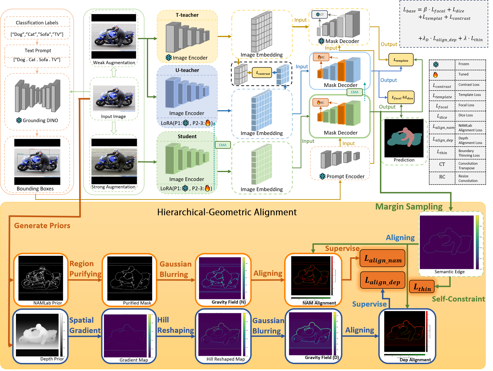

# HGA: Internalizing Decision-Competition via Hierarchical-Geometric Alignment

### A Plug-and-Play Boundary Internalization Paradigm for Weakly Supervised Semantic Segmentation

<div align="center">

<!-- [](https://arxiv.org/) -->
[](LICENSE)
[](https://www.python.org/)
[](https://pytorch.org/)

</div>

---

## 📢 Attribution & Licensing Notice

This repository presents an **independent reimplementation** of the Co2SAM training paradigm (dual-teacher / single-student with EMA). The algorithmic concept of Co2SAM belongs to its original authors; the code implementation in this repository is our own original work. All files have undergone substantial rewriting—the training loop, loss architecture, model routing, data loading, and configuration system have been built from scratch.

**Co2SAM original paper:**  
> Liu *et al.*, "Co2SAM: Exploring Co-Occurrence Challenges With SAM in Weakly Supervised Semantic Segmentation," *IEEE IoTJ*, 2025.

**If you use this code in your research, please cite the original Co2SAM paper, along with the other baseline works referenced at the bottom of this document.**

---

## 🔥 Qualitative Comparison (SOTA Visual Comparison)

<p align="center">
  
</p>

> **Qualitative comparison of state-of-the-art single-stage WSSS methods under challenging scenarios prone to severe decision-competition.** In scenarios involving adjacent foreground occlusion, fine topological structures, multiple targets, and low-contrast boundaries, existing single-stage frameworks often exhibit mask erosion, structural fragmentation, and boundary overflow. In contrast, our approach (HGA) significantly mitigates these artifacts and suppresses boundary overflow without relying on any post-processing.

---

## 🧠 Conceptual Framework (What is HGA?)

**HGA (Hierarchical-Geometric Alignment)** is a generic, plug-and-play paradigm designed to internalize boundary refinement into the training stage of weakly supervised semantic segmentation (WSSS). It requires **zero architectural modification** to the host model, and eliminates the **mandatory reliance** on offline post-processing (such as DenseCRF) for achieving sharp boundaries natively, while remaining **fully complementary** with such methods for further refinement.

### Core Mechanism

Weakly supervised models inherently lack pixel-level spatial guidance, leading to severe **decision-competition**—where the network hesitates between the Top-1 and Top-2 classes in transition zones:

1.  **Prior-Guided Attractor Field**: We extract 2D hierarchical region contours (from NAMLab) and 3D relative depth geometric gradients (from Depth Anything V2). Following a region-based purification operator, these discrete boundaries undergo non-linear Hill-equation stretching and a $\sigma^4$ scale-enhancement Gaussian diffusion, synthesizing a continuous **Prior-Guided Attractor Field**.
2.  **Decision-Competition Alignment Loss**: We construct a **Semantic Edge Probe** within the multi-class logit probability space to capture the margin between the Top-1 and Top-2 class probabilities. The alignment loss uses the attractor field as a potential well, online guiding predicted boundaries toward true contours during the forward pass.
3.  **Boundary-Thinning Self-Constraint**: A self-supervised constraint based on local uncertainty energy is introduced to penalize clumped diffusion of the probe response, forcing decision boundaries to converge to a single-pixel width.

---

## 🎨 Deployment Architecture Overview

<p align="center">
  
</p>

> **Overview of the HGA paradigm deployed on the Co2SAM host.** The pipeline highlighted within the orange box constitutes the core stream of HGA (Prior Processing -> Attractor Field -> Probe -> Alignment & Thinning Loss). The remaining components (dual-teacher architecture, EMA update, and Grounding DINO spatial prompts) belong to the established Co2SAM baseline. The Resize-Convolution Decoder (RC-Decoder) and the EfficientViT-SAM backbone represent our architectural adaptations and upgrades implemented on the host.

---

## 📊 Quantitative Evaluation & Results

### 1. Peak Performance Comparison

By deploying HGA on an upgraded, high-performance host (equipped with the EfficientViT-XL0 SAM backbone), our framework establishes a highly competitive benchmark for single-stage WSSS on both the PASCAL VOC 2012 and MS COCO 2014 datasets.

| Configuration | VOC Val mIoU | VOC Test mIoU | COCO Val mIoU | VOC Weights | COCO Weights |
|:---|:---:|:---:|:---:|:---:|:---:|
| Co2SAM Baseline (ViT-B) | 81.15% | `[TBD]` | 57.22% | — | — |
| **Co2SAM + HGA + Efficient (Ours)** | **84.91%** | `[TBD]` | **59.31%** | [Download](https://huggingface.co/Uncertainty-42/HGA_Co2SAM_based/blob/main/best_model_voc.pth) | [Download](https://huggingface.co/Uncertainty-42/HGA_Co2SAM_based/blob/main/best_model_coco.pth) |

*\*Note: For our HGA-enhanced model (Row 2), the RC (Resize-Convolution) decoder is employed for PASCAL VOC, while the CT (transposed convolution) decoder is used for MS COCO.*

### 2. Generalizability Comparison on VOC 2012 Val

To validate the generalizability of HGA, we deploy it on three technically orthogonal WSSS hosts, keeping all HGA core hyperparameters identical (only linearly scaling the loss coefficients to match the scale of each host's $\mathcal{L}_{base}$). The evaluation demonstrates that **the online, parameterized internalization gain of HGA consistently exceeds the offline gain of traditional DenseCRF post-processing**.

| Host Baseline | Baseline mIoU (w/o CRF) | Baseline w/ CRF | **CRF Gain** | Baseline + HGA (w/o CRF) | **HGA Gain** |
|:---|:---:|:---:|:---:|:---:|:---:|
| **Co2SAM** (ViT-B, CT) | 81.15% | 81.44% | **+0.29%** | **83.26%** | **+2.11%** |
| **ExCEL** (Multi-scale) | 76.40% | 77.50% | **+1.10%** | **78.90%** | **+2.50%** |
| **DuPL** (Multi-scale) | 69.50% | 70.50% | **+1.00%** | **71.90%** | **+2.40%** |

---

## 📂 Repository Directory Routing

This repository is split into two functional subdirectories. Please navigate according to your requirements:

*   **`HGA_Co2SAM_based/`**: Contains our fully refactored and upgraded dual-teacher training framework (supporting original ViT-B SAM and lightweight EfficientViT-SAM, integrated with the RC-Decoder and HGA constraints). **Use this directory to reproduce the peak performance benchmarks reported in our paper.**
*   **`HGA_plugin/`**: A lightweight, standalone toolkit containing only the core HGA modules (losses, probe, and preprocessing pipeline) with zero heavy VFM host dependencies, accompanied by integration guides. **Use this directory to integrate HGA into your own custom WSSS models.**

---

## ⚙️ Core Prior Data Acquisition

HGA relies on two offline priors per training image, which are loaded on-the-fly by our DataLoader. You only need to obtain them once before training:

1.  **NAMLab Hierarchical Priors (pre-computed `.pt` files)**:
    The purified region priors have been uploaded to Hugging Face Datasets. Download and place them in your configured directories:
    *   [PASCAL VOC 2012 NAMLab Priors](https://huggingface.co/datasets/Uncertainty-42/PascalVOC_NAMLab_pt)
    *   [MS COCO 2014 NAMLab Priors](https://huggingface.co/datasets/Uncertainty-42/MSCOCO_NAMLab_pt)
2.  **Depth Geometric Priors (locally generated)**:
    To avoid transferring gigabytes of redundant files, we provide a standalone script `generate_depth_prior.py` that utilizes **Depth Anything V2** to extract depth maps locally and save them as lightweight `.npy` arrays.

*Detailed environment setups, pretrained checkpoint downloads, priors downloads and build steps are documented in the dedicated `README.md` within each subdirectory.*

---

## 📝 References & Citations

Please cite the corresponding papers if you use their respective code components or datasets in your work:

```bibtex
@article{DBLP:journals/iotj/LiuSZXCL25,
  author       = {Chunmeng Liu and
                  Yao Shen and
                  Haoran Zhou and
                  Qingguo Xiao and
                  Qiaochuan Chen and
                  Guangyao Li},
  title        = {Co2SAM: Exploring Co-Occurrence Challenges With {SAM} in Weakly Supervised
                  Semantic Segmentation},
  journal      = {{IEEE} Internet Things J.},
  volume       = {12},
  number       = {21},
  pages        = {45094--45105},
  year         = {2025},
  url          = {https://doi.org/10.1109/JIOT.2025.3598824},
  doi          = {10.1109/JIOT.2025.3598824}
}

@inproceedings{DBLP:conf/nips/YangKH0XFZ24,
  author       = {Lihe Yang and
                  Bingyi Kang and
                  Zilong Huang and
                  Zhen Zhao and
                  Xiaogang Xu and
                  Jiashi Feng and
                  Hengshuang Zhao},
  editor       = {Amir Globersons and
                  Lester Mackey and
                  Danielle Belgrave and
                  Angela Fan and
                  Ulrich Paquet and
                  Jakub M. Tomczak and
                  Cheng Zhang},
  title        = {Depth Anything {V2}},
  booktitle    = {Advances in Neural Information Processing Systems 37: Annual Conference
                  on Neural Information Processing Systems 2024, NeurIPS 2024, Vancouver,
                  BC, Canada, December 10 - 15, 2024},
  year         = {2024},
  url          = {http://papers.nips.cc/paper\_files/paper/2024/hash/26cfdcd8fe6fd75cc53e92963a656c58-Abstract-Conference.html}
}

@article{DBLP:journals/tip/ZhengYS21,
  author       = {Yunping Zheng and
                  Bowen Yang and
                  Mudar Sarem},
  title        = {Hierarchical Image Segmentation Based on Nonsymmetry and Anti-Packing
                  Pattern Representation Model},
  journal      = {{IEEE} Trans. Image Process.},
  volume       = {30},
  pages        = {2408--2421},
  year         = {2021},
  url          = {https://doi.org/10.1109/TIP.2021.3052359},
  doi          = {10.1109/TIP.2021.3052359}
}
```

---

## 🙏 Acknowledgements

Our code implementation borrows components and engineering designs from the following open-source projects. We express our sincere gratitude to their authors:

*   **Segment Anything (SAM)**: [segment-anything](https://github.com/facebookresearch/segment-anything)
*   **Grounding DINO**: [GroundingDINO](https://github.com/IDEA-Research/GroundingDINO)
*   **Detectron2**: [detectron2](https://github.com/facebookresearch/detectron2)
*   **Depth Anything V2**: [Depth-Anything-V2](https://github.com/DepthAnything/Depth-Anything-V2)
*   **NAMLab Framework**: [NAMLab](https://github.com/YunpingZheng/NAMLab)

---

## 📄 License

This project is licensed under the **MIT License**. See `LICENSE` for details.